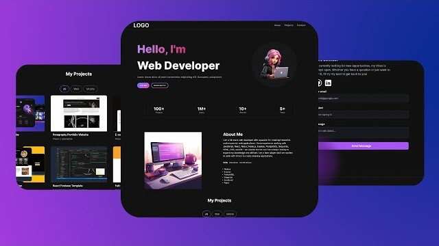
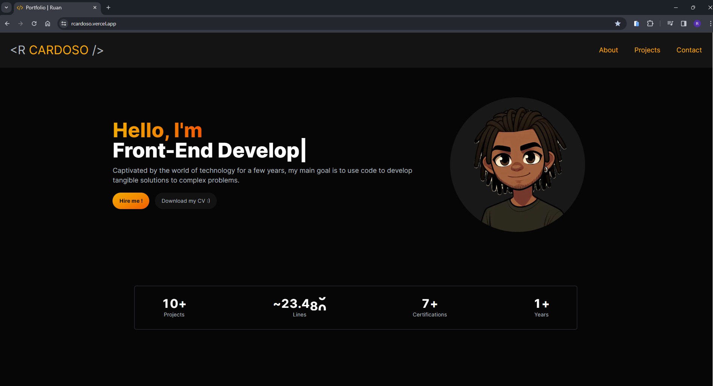
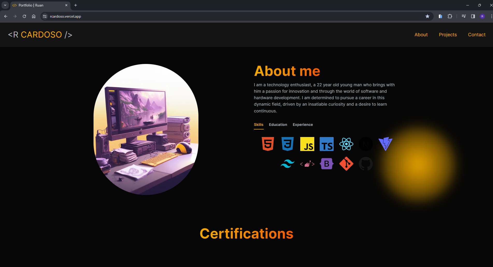
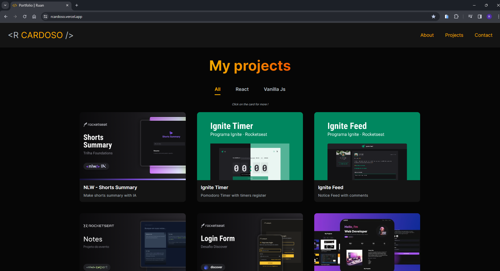

# Portfolio 📚

# Portfolio Pessoal 💭

> ## Descrição 📚
Este projeto consiste em um portfolio pessoal que fins de divulgação e compartilhamento dos conhecimentos adquiridos e projetos realizados, e cursos finalizados. Esse app foi todo desenvolvido principalmente com React e Next.

 
 

> ## Tecnologias 👨🏾‍💻
Foram utilizadas as seguintes tecnologias neste projeto:
+ React.Js :
  -  Lib Js para desenvolvimento de interfaces modernas baseadas em componentes.
+ Next.Js:
  - Framework React.
+ Tailwind CSS:
  - Principal estilizador baseado em classes.
+ Framer Motion:
  - Lib de animações de componentes.
+ Swiper:
  - Lib de geração de carrosel.
+ Hero Icons:
  - Lib de icons para React.
+ React Animated Numbers:
  - Lib React para animação de números.
+ React Type Animation:
  - Lib React para animação de textos.

 
 

> ## Printscreen do Projeto 📸
 ### Preview 1

 ### Preview 2

 ### Preview 3

 
 

> ## Autor 📝
+ [Ruan Cardoso](https://www.linkedin.com/in/ruancardosolinkdin/)
